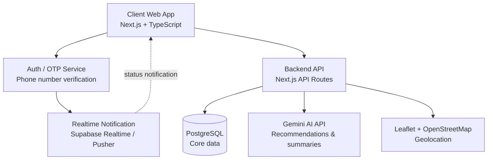
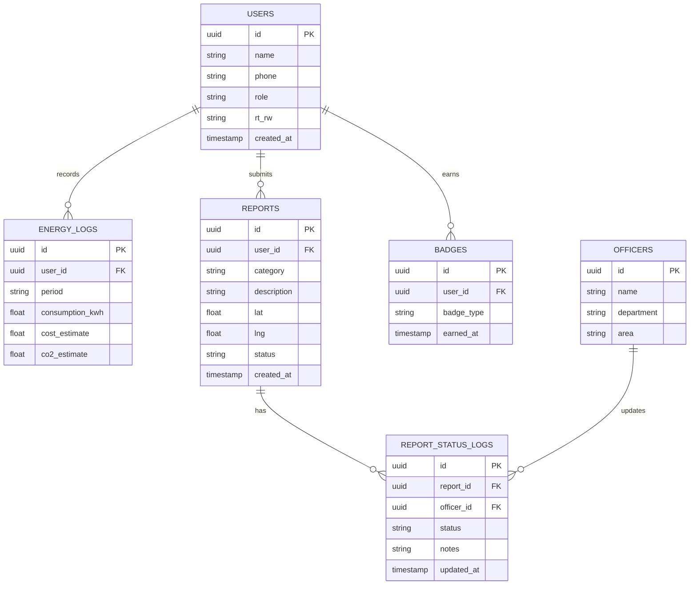
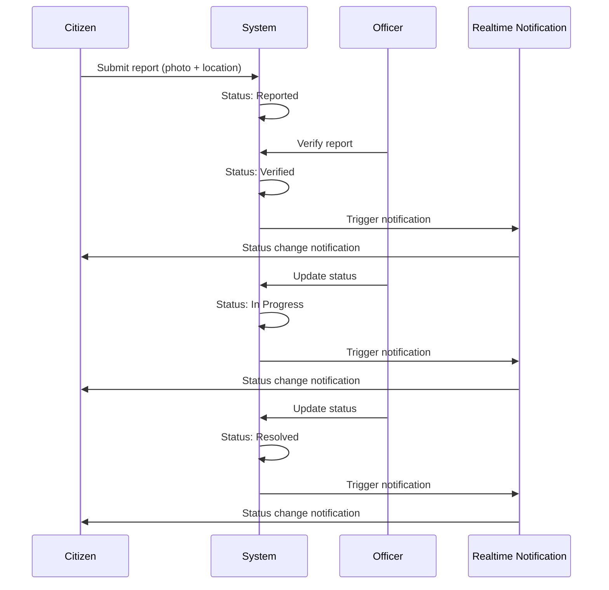

# EcoLur Architecture

This document contains the system architecture, per-actor use cases, database schema (ERD), and the report status flow in full — nothing is left implicit in prose only.

---

## 1. System Architecture

Notes:
- **Auth/OTP** and **Backend API** are logically separated even though they run within a single Next.js deployment (different API routes).
- **Realtime Notification** pushes updates to the client every time `ReportStatusLog` gets a new row.
- **Gemini AI API** is called from the server (API routes), never directly from the browser.

---

## 2. Use Cases per Actor

### Actor: Citizen

| # | Use case | Description |
|---|---|---|
| 1 | Log in via OTP | Passwordless authentication using phone number |
| 2 | Input energy consumption | Enter monthly electricity usage data |
| 3 | View energy-saving recommendations | Automatic insight from Gemini API based on consumption history |
| 4 | View score & energy-saving badges | Gamification based on consumption reduction |
| 5 | Report a public issue | Submit a report with photo & location pin |
| 6 | Track report status | View the status history of one's own reports |
| 7 | Receive report status notifications | Realtime notification when status changes |
| 8 | View the city transparency dashboard | Public aggregate statistics (no personal data) |

### Actor: Local Officer

| # | Use case | Description |
|---|---|---|
| 1 | Log in | Authentication specific to officer accounts |
| 2 | View incoming reports by area | Filter reports by assigned area |
| 3 | Verify report | Determine whether a report is valid before processing |
| 4 | Update report status | Change status to In Progress/Resolved (inserts a new log row) |
| 5 | Add follow-up notes | Internal notes related to handling the report |

### Actor: Local Government / Admin

| # | Use case | Description |
|---|---|---|
| 1 | Log in | Authentication specific to admin accounts |
| 2 | View aggregate SDG dashboard | Energy & report statistics as SDG impact indicators |
| 3 | View data distribution map | Geographic visualization of reports & energy consumption |
| 4 | Export report data | Download data for further reporting/analysis |
| 5 | Manage officer accounts | Add/deactivate local officer accounts |

---

## 3. Entity Relationship Diagram (ERD)

**Design principle**: `REPORT_STATUS_LOGS` is append-only — every status change becomes a new row rather than overwriting the previous one. This guarantees a complete audit trail for transparency to local government and judges.

---

## 4. Report Status Flow

Every status transition creates a new row in `REPORT_STATUS_LOGS` and triggers a realtime notification to the reporting citizen.

---

## 5. AI Integration Points

| Feature | Endpoint | Input | Output |
|---|---|---|---|
| Energy-saving recommendation | `POST /api/ai/recommend` | Citizen's `EnergyLog` history | Recommendation text in natural language |
| Report summary & classification | `POST /api/ai/summarize` | A set of `Report`s per area/category | Issue pattern summary + automatic category |

Model used: **Google Gemini API (Flash/Flash-Lite, free tier)**, called from server-side API routes.
